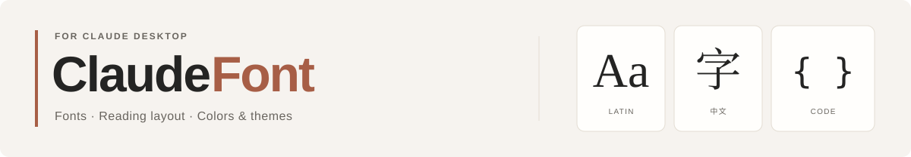

<picture>
  <source media="(prefers-color-scheme: dark)" srcset="docs/assets/readme-header-dark.svg">
  
</picture>

**为 Claude 桌面版设置你喜欢的字体与阅读布局。** 中英文分别调整，代码独立设置，常用样式保存为主题。

<p>
  <a href="https://github.com/Orxooo/claudefont/releases/latest"></a>
  &nbsp; <a href="README.en.md">English</a> · <a href="CHANGELOG.md">更新记录</a>
</p>

Apple Silicon · macOS 26+ · GPL-3.0-only · 运行无需 Python 或 Xcode


<sub>截图来自 V1.0.0（构建 4），保留历史名称 claudefont。当前源码名称为 ClaudeFont；界面预览使用示例内容。</sub>

## 按你的习惯调整

<table>
<tr>
<td width="50%" valign="top"><strong>中英文独立字体</strong><br>分别选择字体与字号，界面显示比例独立调整。</td>
<td width="50%" valign="top"><strong>更舒适的阅读布局</strong><br>调整正文行距、段落间距与阅读宽度。</td>
</tr>
<tr>
<td width="50%" valign="top"><strong>代码区域分别设置</strong><br>回复、代码块、Diff、编辑器与终端独立调整。</td>
<td width="50%" valign="top"><strong>浅色底色与深色主题</strong><br>自选配色，协调正文、链接、代码与 Diff。</td>
</tr>
<tr>
<td width="50%" valign="top"><strong>保存与分享主题</strong><br>内置阅读、代码审查、大字模式；支持 JSON 导入导出。</td>
<td width="50%" valign="top"><strong>备份、测试与还原</strong><br>完整应用备份，独立测试副本，操作结果可查日志。</td>
</tr>
</table>

<details>
<summary>查看代码与配色页面</summary>

**代码：** 为各区域设置字体与字号，查看对应的示例预览。


**背景：** 浅色底色与深色主题分别设置。


</details>

## 从下载到应用

1. **安装。** 从[发行页](https://github.com/Orxooo/claudefont/releases/latest)下载 macOS ZIP，核对摘要后解压，将应用放入「应用程序」。
2. **选择目标。** 在「概览」选择 Claude 并检测权限；首次使用建议先建立测试副本。
3. **调整并应用。** 选择字体、代码与配色，或载入主题。彻底退出目标 Claude，再点击「应用设置」。
4. **确认效果。** 重新打开所选 Claude，检查实际显示；需要撤销时，选择「还原应用」。

关闭窗口不等于退出 Claude。预览与载入主题不会自动应用；写入前会创建完整备份，失败时会尝试回滚。

<details>
<summary>下载校验与 macOS 首次打开</summary>

现有 V1.0.0（构建 4）发行包使用 Apple 开发证书签名，未经 Apple 公证。若首次打开被拦截，确认来源和摘要后，到「系统设置 → 隐私与安全性」选择「仍要打开」。

下载 `SHA256SUMS.txt`，将 ZIP 摘要与清单中的同名条目核对：

```sh
shasum -a 256 claudefont-1.0.0-macOS-arm64.zip
```

当前源码构建产物为 `ClaudeFont.app`；历史发行包仍可能使用 `claudefont.app` 名称。文件名与版本以对应发行页为准。

</details>

## 使用前了解

- **兼容性：** [既有验证记录](docs/VERIFICATION.md)涵盖 Claude 2.19675.0 的启动与宋体显示。其他版本、全部代码区域、Cowork / 虚拟机及账号网络功能尚未逐项验证；未知终端资源会拒绝适配。
- **应用与还原：** 工具会修改并重新签名 Claude，嵌套组件保留原有签名。恢复需要匹配当前版本的完整原版备份；没有匹配备份时，请[重新安装官方 Claude](https://claude.ai/download)。
- **测试与数据：** 测试副本使用独立配置，不复制正式 Claude 的登录或会话数据。操作在本机执行；更新检查访问 GitHub Releases。

<details>
<summary>设置范围、主题与更新</summary>

- 字号：80%–150%；正文行距：1.2–2.4 倍；段落间距：4–40 px；阅读宽度：480–1100 px。
- 英文可仅覆盖回复与标题，或同时覆盖界面、输入框和用户消息。
- 浅色底色与深色主题分别生效，不会主动切换 Claude 的外观模式。
- 终端保留自身字符网格与行距；代码连字取决于字体支持。
- 主题只分享样式设置，不包含字体文件；缺失字体会提示。
- Claude 更新后先重新检查兼容性，再应用保存的设置。工具更新需手动下载替换，同版本的新构建不会触发版本更新提示。

</details>

<details>
<summary>无法应用、接续已有修改与问题反馈</summary>

确认字体已安装、目标选择正确，并已彻底退出 Claude。访问被拒绝时，按提示开启 macOS「App 管理」权限，再重新检测。

目标已有字体修改时，在「概览」选择「接续已有修改」，提供同版本的完整原版 `.app` 备份，以及含 `config.json` 和可选 `themes.json` 的设置文件夹。核验通过后再应用。

通过 [Issues](https://github.com/Orxooo/claudefont/issues/new/choose) 提供系统、Claude、ClaudeFont 版本与构建号、目标类型、复现步骤和脱敏日志。请移除用户名、私人路径、聊天内容与登录资料。

</details>

<details>
<summary>本机数据位置</summary>

| 内容 | 默认位置 |
| --- | --- |
| 设置与主题 | `~/.config/claudefont/` |
| 完整备份、日志与事务记录 | `~/.local/share/claudefont/` |
| 测试应用与独立配置 | `~/Library/Application Support/claudefont/` |

改名保留原有 Bundle ID、CLI 命令与数据目录；正常替换应用会保留设置、主题与备份。工具不会上传聊天记录、登录信息或 API 密钥。

</details>

## 开发与贡献

[构建与 CLI](docs/DEVELOPMENT.md) · [代码结构](docs/ARCHITECTURE.md) · [验证范围](docs/VERIFICATION.md) · [贡献指南](CONTRIBUTING.md)

需要支持 macOS 26 的 Xcode / Swift 工具链与有效的 Apple 签名身份。构建输出放在仓库及 iCloud 之外。

```sh
git clone https://github.com/Orxooo/claudefont.git
cd claudefont
./gui/build.sh
```

---

Copyright © 2026 Orxooo · [GPL-3.0-only](LICENSE) · [项目声明](NOTICE)

ClaudeFont 与 Anthropic 无隶属关系，不分发 Claude 的应用代码或字体文件。
